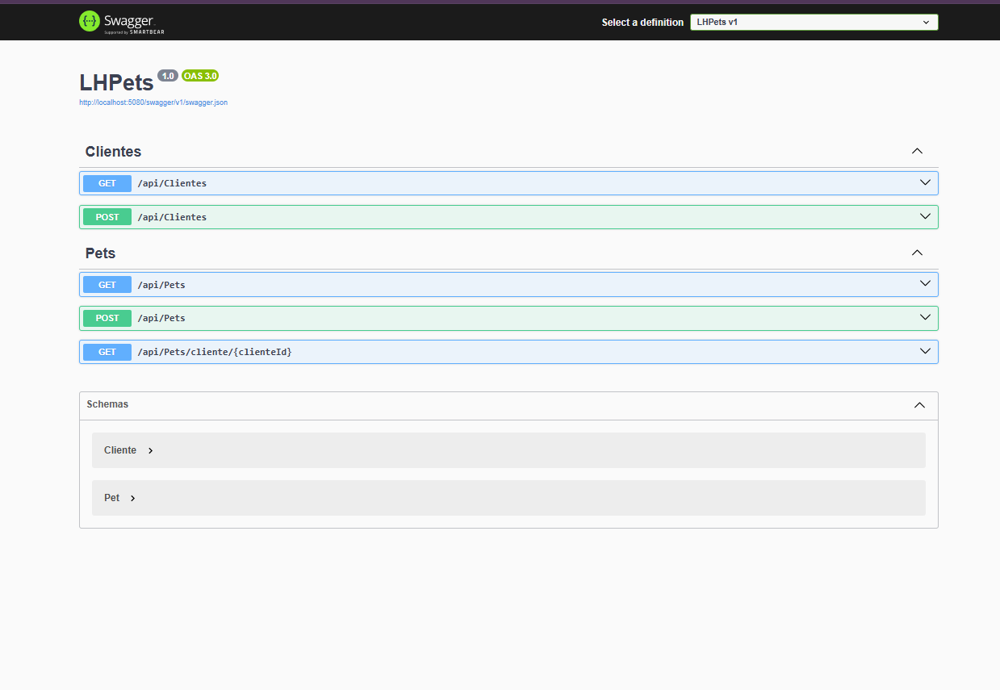
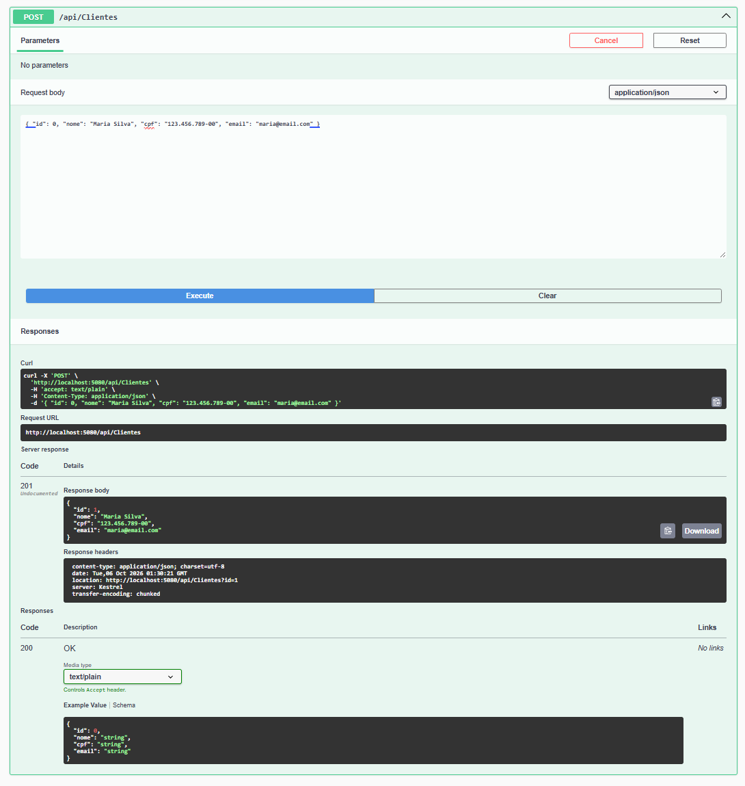
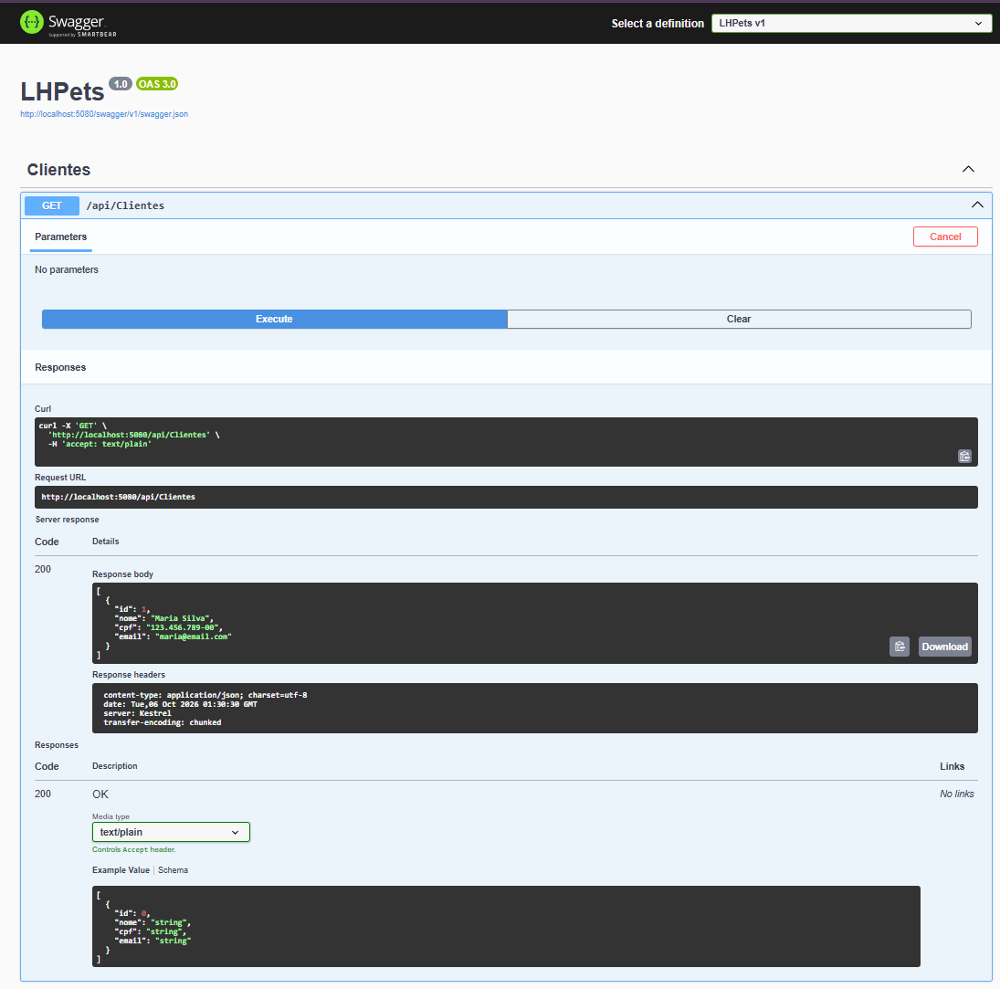
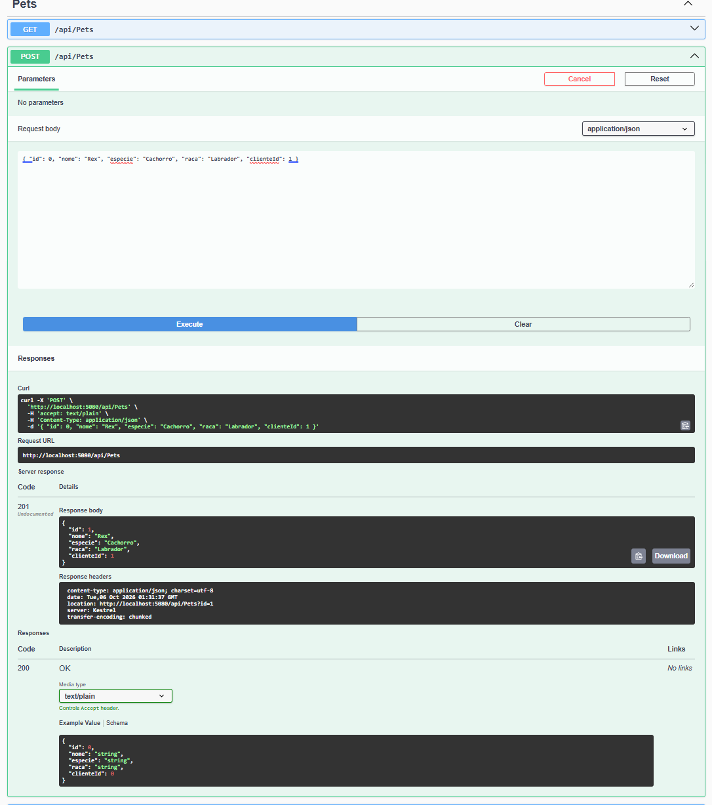
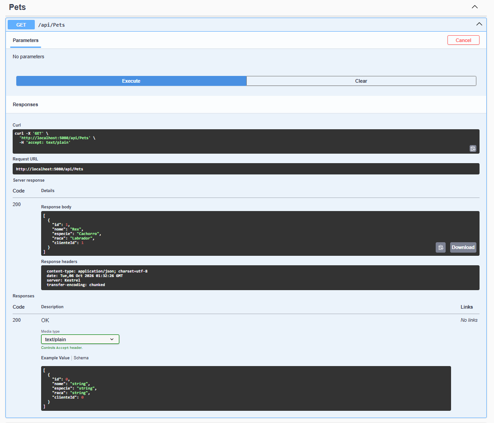
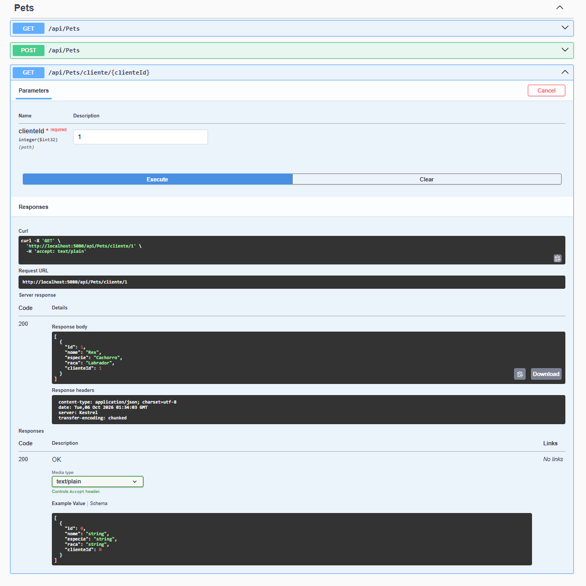
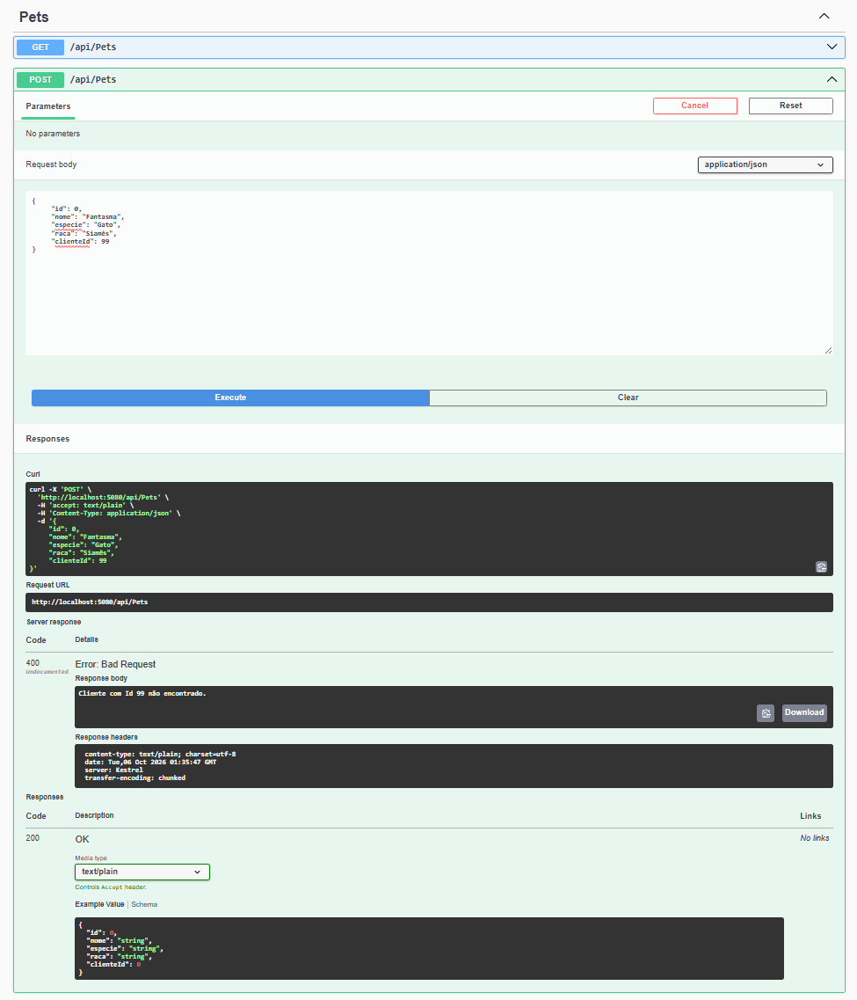

# LH-Pets Web API

Web API desenvolvida em **ASP.NET Core (C#)** no padrão de **Controllers**, para gerenciar o cadastro de clientes e de seus pets da empresa LH-Pets.

Nesta etapa de prototipagem não há banco de dados: todos os dados são armazenados **em memória**, usando coleções `List<T>`, e são perdidos quando a aplicação é encerrada. A API é documentada e testada pelo **Swagger**.

> Atividade avaliativa do SENAI — Programador Full-Stack.

## Tecnologias

- C# / ASP.NET Core Web API (.NET 10)
- Swagger (Swashbuckle.AspNetCore)
- Visual Studio Code e Git

## Estrutura do projeto

```
LHPets/
├── Controllers/
│   ├── ClientesController.cs
│   └── PetsController.cs
├── Models/
│   ├── Cliente.cs
│   └── Pet.cs
├── docs/                  # prints dos testes no Swagger
├── Properties/
│   └── launchSettings.json
├── Program.cs
├── LHPets.csproj
└── README.md
```

## Modelos

**Cliente**

| Propriedade | Tipo   |
|-------------|--------|
| Id          | int    |
| Nome        | string |
| Cpf         | string |
| Email       | string |

**Pet**

| Propriedade | Tipo   | Observação                         |
|-------------|--------|------------------------------------|
| Id          | int    |                                    |
| Nome        | string |                                    |
| Especie     | string |                                    |
| Raca        | string |                                    |
| ClienteId   | int    | Vínculo com o Cliente (dono do pet)|

## Endpoints

| Método | Rota                          | Descrição                                      |
|--------|-------------------------------|------------------------------------------------|
| GET    | /api/clientes                 | Retorna a lista completa de clientes           |
| POST   | /api/clientes                 | Adiciona um novo cliente                       |
| GET    | /api/pets                     | Retorna todos os pets cadastrados              |
| POST   | /api/pets                     | Adiciona um novo pet vinculado a um cliente    |
| GET    | /api/pets/cliente/{clienteId} | Retorna apenas os pets do cliente informado    |

### Regras de validação

- Ao cadastrar um cliente, `Nome`, `Cpf` e `Email` são obrigatórios.
- Ao cadastrar um pet, `Nome` e `Especie` são obrigatórios.
- Só é possível cadastrar um pet se o `ClienteId` informado existir. Caso contrário, a API retorna **400 Bad Request**.
- O `Id` de clientes e pets é gerado automaticamente pela API.

## Como executar

Pré-requisitos: [.NET SDK](https://dotnet.microsoft.com/download) e [Git](https://git-scm.com/).

```bash
git clone https://github.com/SEU_USUARIO/LHPets.git
cd LHPets
dotnet run
```

Depois, abra o Swagger no navegador:

```
http://localhost:5080/swagger
```

## Testes realizados no Swagger

### 1. Tela inicial do Swagger



### 2. POST /api/clientes — cadastro de cliente

Corpo da requisição:

```json
{
  "id": 0,
  "nome": "Maria Silva",
  "cpf": "123.456.789-00",
  "email": "maria@email.com"
}
```



### 3. GET /api/clientes — listagem de clientes



### 4. POST /api/pets — cadastro de pet vinculado ao cliente

Corpo da requisição:

```json
{
  "id": 0,
  "nome": "Rex",
  "especie": "Cachorro",
  "raca": "Labrador",
  "clienteId": 1
}
```



### 5. GET /api/pets — listagem de pets



### 6. GET /api/pets/cliente/{clienteId} — pets de um cliente



### 7. Validação — pet com cliente inexistente

Tentativa de cadastrar um pet com `clienteId: 99`, que retorna **400**.



## Autor

**Caio Correa Barros**
